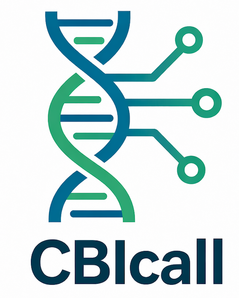

# CBICall

  
   
  <em>Reproducible germline variant calling for WES, WGS, and mtDNA</em>

## What is CBICall?

**CBICall** (**C**NAG **B**iomedical **I**nformatics framework for variant **Call**ing) is a lightweight, reproducible germline variant-calling framework developed at CNAG.  
It wraps established best practices (BWA → GATK → VQSR or hard filters) into easy-to-run **Bash** and **Snakemake** workflows, enabling labs to produce high-quality single-sample and cohort VCFs with minimal effort. 🧬

---

## Why CBICall?

- Implements GATK best practices (GATK 4.6 and GATK 3.5 legacy modes), tuned for real project needs.
- Supports both single-sample and cohort pipelines (WES and WGS), using GenomicsDBImport or per-chromosome sharding.
- Includes robust mitochondrial DNA analysis via MToolBox with heteroplasmy-aware calling.
- Simple YAML configuration with sensible defaults for fast onboarding.
- Transparent logs and structured outputs suitable for QC, auditing, and downstream interpretation.

---

## Key features

- Per-sample preprocessing: alignment, read groups, merging, duplicates, and BQSR.
- High-quality variant calling: per-sample gVCFs and scalable joint genotyping.
- Variant quality control: VQSR when possible, with reproducible hard-filter fallback.
- mtDNA pipelines: MToolBox-based assembly, annotation, and heteroplasmy estimation.
- Flexible deployment: Bash and Snakemake workflows; supports containerized environments.
- Utility tools: coverage estimation, sex determination, basic cohort QC metrics.

---

[➡️ Get Started](usage/quickstart.md){ .md-button .md-button--primary }
