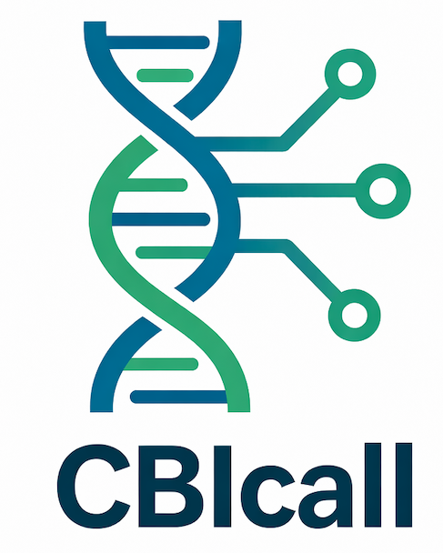

# CBIcall

  
   
  <em>Reproducible germline variant calling for Illumina DNA sequencing</em>

---

## What is CBIcall?

**CBIcall** (**C**NAG **B**iomedical **I**nformatics framework for variant **call**ing) is a framework for running **Illumina-based germline variant calling workflows** using curated **Bash** and **Snakemake** pipelines.

The system provides a command-line interface, a validated YAML configuration, and a registry-driven dispatcher that ensures only supported workflows are executed.

---

## Core functionality

CBIcall is a workflow **orchestrator**: it runs predefined pipelines but does **not re-implement bioinformatics tools**.

It performs the following tasks:

- Validates user parameters and compatibility (engine, GATK version, genome, mode)
- Loads a versioned workflow registry (YAML) validated with JSON Schema
- Resolves workflow scripts and checks that referenced files exist and are executable
- Creates a per-run project directory with a unique run identifier
- Executes the selected workflow and captures stdout/stderr into a unified log file

All biological processing is performed by external tools and workflows (e.g. BWA, GATK, MToolBox).

---

## Supported pipelines

--8<-- "tbl/supported-pipelines.md"

---

## Workflow engines

CBIcall dispatches workflows declared in an external registry:

- **Bash** (fully supported)
- **Snakemake** (supported with GATK ≥ 4.6)
- **Nextflow** (declared but not implemented)

Workflow resolution order:
engine → GATK version → pipeline → mode

Only workflows declared in the registry **and present on disk with executable permissions** can be executed.

---

## Configuration philosophy

CBIcall uses a single YAML parameter file with:

- Explicit defaults
- Strict enum validation
- Fail-fast semantic checks (e.g. incompatible genome/pipeline combinations)
- Limited parameter inference where appropriate (e.g. default genome selection)

This design helps detect configuration errors before workflow execution.

---

## Reproducibility and traceability

For every run, CBIcall:

* Generates a unique run identifier
* Creates a dedicated project directory
* Writes a structured `log.json` containing:
    - CLI arguments
    - Resolved configuration
    - User parameters
* Captures the workflow stdout/stderr into a single log file

These records allow runs to be inspected, reproduced, and debugged.

---

## Getting started

[➡️ Choose Your Path](usage/choose-your-path.md){ .md-button }
[➡️ Get Started](usage/quickstart.md){ .md-button .md-button--primary }
