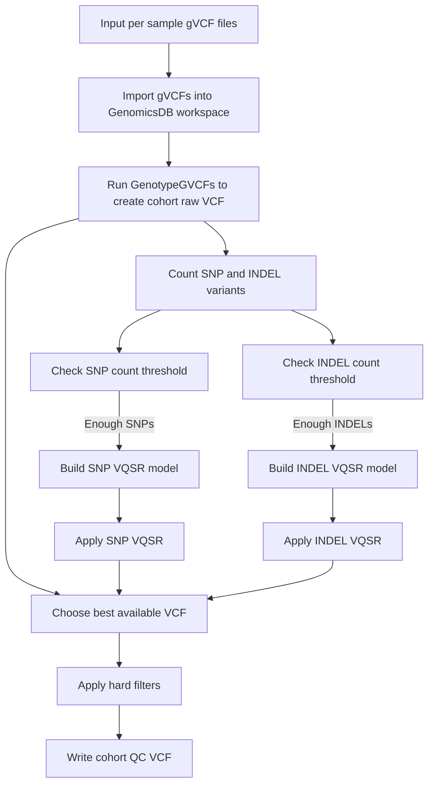

# WES/WGS Cohort Joint-Genotyping Pipeline  

A user-oriented guide for multi-sample joint genotyping using GenomicsDB, GenotypeGVCFs, and VQSR.


??? Example "See Bash pipeline:"

    ```bash
    --8<-- "https://raw.githubusercontent.com/CNAG-Biomedical-Informatics/cbicall/refs/heads/main/workflows/bash/gatk-4.6/wes_cohort.sh"
    ```

---

## Diagram: Cohort Joint-Genotyping Workflow



---

## Purpose

This pipeline combines many per-sample gVCFs and performs **cohort-level joint genotyping**, producing a single VCF for all samples with consistent genotype calls and variant filtering.

Use this when:

- You want consistent genotypes across a family or population.
- You plan to build VQSR models on cohort-level variant distributions.
- You are preparing a joint VCF for association or segregation analyses.

---

## Inputs

- **Sample map file** (`--sample-map`):  
  TSV used by `GenomicsDBImport` (sample name → gVCF path).
- **Per-sample gVCFs** from the single-sample pipeline.
- **Reference genome** (`REF` from `parameters.sh`).
- **VQSR resources** (SNP and INDEL training sets).
- Optional **interval list** for WES mode.

---

## Workflow

### 1. GenomicsDBImport

- Imports all gVCFs into a **GenomicsDB workspace**.
- Handles both WES (interval-limited) and WGS (whole genome) modes.
- Output: on-disk database accessed as `gendb://<workspace>`.

### 2. Joint Genotyping (GenotypeGVCFs)

- Runs `GenotypeGVCFs` on `gendb://<workspace>` and the reference.
- Produces the cohort-level VCF:

  - `cohort.gv.raw.vcf.gz`

### 3. Count Variants and Decide on VQSR

- Counts SNPs and INDELs in the raw cohort VCF.
- Compares counts to configurable thresholds:
  - `MIN_SNP_FOR_VQSR` (default 1000)
  - `MIN_INDEL_FOR_VQSR` (default 8000)
- Determines whether to build SNP and/or INDEL VQSR models.

### 4. Build VQSR SNP Model

- If enough SNPs:
  - Run `VariantRecalibrator` in SNP mode.
  - Uses training resources and multiple annotations:
    - QD, FS, MQ, MQRankSum, ReadPosRankSum.
  - Outputs:
    - `cohort.snp.recal.vcf.gz`
    - `cohort.snp.tranches.txt`.

### 5. Build VQSR INDEL Model

- If enough INDELs:
  - Run `VariantRecalibrator` in INDEL mode.
  - Uses annotations:
    - QD, FS, ReadPosRankSum.
  - Outputs:
    - `cohort.indel.recal.vcf.gz`
    - `cohort.indel.tranches.txt`.

### 6. Apply VQSR

- If SNP model exists:
  - Apply SNP VQSR → `cohort.post_snp.vcf.gz`.
- If INDEL model exists:
  - Apply INDEL VQSR → `cohort.vqsr.vcf.gz`.

The best available VCF (VQSR-filtered or raw) is used as input to the next step.

### 7. Hard Filtering and QC VCF

- Run `VariantFiltration` with a set of hard filters on:
  - QUAL, QD, FS, MQ, MQRankSum, ReadPosRankSum.
- Output: `cohort.gv.QC.vcf.gz`.

This QC VCF is the recommended cohort VCF for downstream analysis.

---

## Output Files

| File                                | Description                                        |
|-------------------------------------|----------------------------------------------------|
| `cohort.gv.raw.vcf.gz`              | Raw cohort joint-genotyped VCF                    |
| `cohort.snp.recal.vcf.gz`           | SNP VQSR model VCF                                |
| `cohort.snp.tranches.txt`           | SNP VQSR tranches and diagnostics                 |
| `cohort.indel.recal.vcf.gz`         | INDEL VQSR model VCF                              |
| `cohort.indel.tranches.txt`         | INDEL VQSR tranches and diagnostics               |
| `cohort.post_snp.vcf.gz`            | VCF after applying SNP VQSR                       |
| `cohort.vqsr.vcf.gz`                | VCF after applying SNP and INDEL VQSR             |
| `cohort.gv.QC.vcf.gz`               | Final hard-filtered cohort QC VCF (recommended)   |
| `logs/cohort_joint_genotyping.log`  | Main log file for the cohort pipeline             |

---

## When to Use This Pipeline

- After you have gVCFs from the **single-sample** pipeline.
- When you need a single VCF for all samples for:
  - Family-based segregation analysis.
  - Case/control or population cohorts.
  - Downstream tools that expect joint genotypes.

