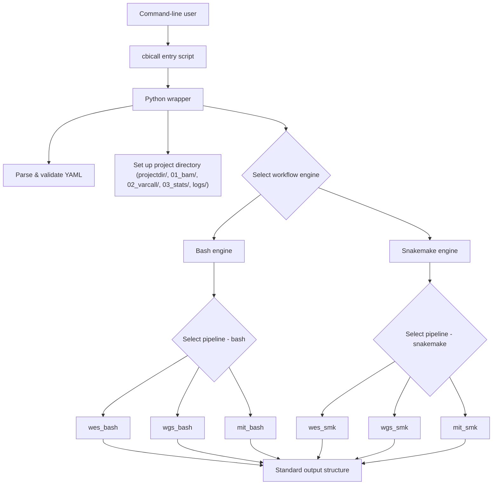

## Overview

CBIcall is a thin orchestration layer around one or more concrete pipelines. Its main responsibilities are:

- Reading a YAML configuration file
- Validating required parameters and paths
- Selecting the pipeline and workflow engine
- Preparing the project directory structure
- Calling the appropriate workflow scripts (Bash or Snakemake)
- Managing logs and collecting results in a standard layout

The actual bioinformatics work (alignment, variant calling, QC) is implemented in modular pipelines that can be extended or replaced.

---

## Main components

At a high level, CBIcall consists of:

- **Python wrapper**  
  Parses the YAML configuration, validates parameters, resolves paths and dispatches to the selected pipeline and engine.

- **Pipelines**  
  Implement the domain logic for WES, WGS and mtDNA runs. Each pipeline lives in its own directory and can provide Bash and/or Snakemake workflows.  
  Common parameters are loaded via `parameters.sh`.

- **Workflow engines**  
  Control execution:
  - Bash scripts for simple, transparent runs
  - Snakemake workflows for dependency tracking and parallelization

- **Project layout and logs**  
  A standard output structure with separate `01_bam/`, `02_varcall/`, `03_stats/` and `logs/` directories, reused across all pipelines.

- **External data**  
  Executables and databases for third-party tools, reference genomes and accessory data.

---

## Architecture diagram



---

## Directory structure

```text
<projectdir>/
  01_bam/
  02_varcall/
  03_stats/
  logs/
```

Typical usage:

- Intermediate alignment and BAM files are stored under `01_bam/`.
- Variant-calling outputs (gVCFs, VCFs and related files) are stored under `02_varcall/`.
- Summary statistics and QC metrics are collected under `03_stats/`.
- Log files for all steps are stored under `logs/`.

---

## Execution model

CBIcall supports two main execution modes:

- **Single mode**  
  Each sample is processed independently.

- **Cohort mode**  
  Joint analysis using per-sample gVCFs from previous single runs.

The workflow engine is selected in the YAML:

- `workflow_engine: bash`  
- `workflow_engine: snakemake`

---

## Supported pipelines

The following table shows valid pipeline and mode combinations for each GATK version:

| GATK Version | wes\_single | wes\_cohort | wgs\_single | wgs\_cohort | mit\_single | mit\_cohort |
|--------------|------------|------------|------------|------------|------------| -----------|
| gatk3.5      | +          | +          | -          | -          |   +        | +          |
| gatk4.6      | +          | +          | +          | +          |   -        | -          |

Date: Oct-2025

---

## Extensibility

New pipelines can be added without modifying the core system:

- Each pipeline lives under `workflows/<name>/`
- The wrapper maps `pipeline: <name>` to the correct implementation
- Pipelines reuse the same directory layout and logging conventions
- Pipelines may support single and/or cohort mode

See:

[➡️ Extend Pipelines](extend-pipelines.md){ .md-button .md-button--primary }
