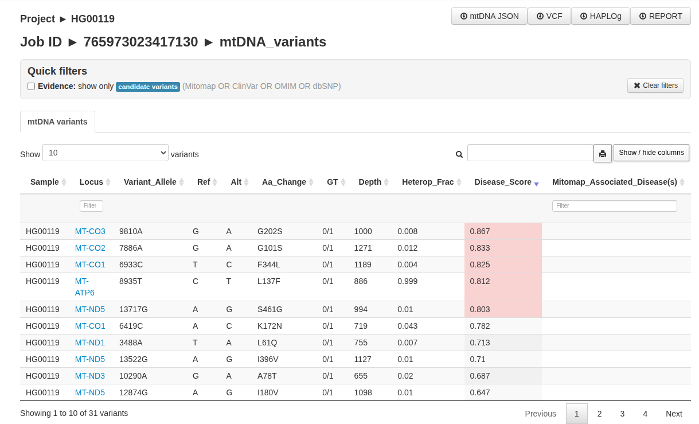
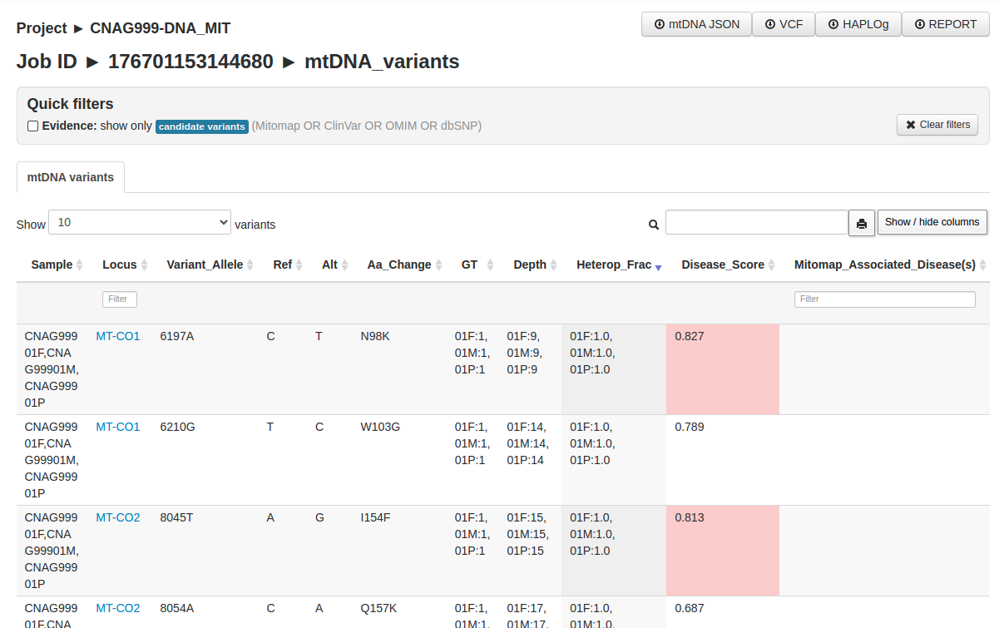

# End-to-end examples (MToolBox)

!!! note "Prerequisites"
    Installation, reference bundles, and all dependencies must be completed beforehand.  

    [➡️ Installation](../installation/non-containerized.md){ .md-button .md-button--primary }

!!! warning "Architecture"
    MToolBox supports **x86_64 only**. ARM-based systems, including Apple Silicon (M1/M2/M3), are **not supported**.

---

=== "MIT single-sample run"

    ## 1. Before running mtDNA calling you must have a `bam` file coming from wes/wgs
    
    !!! example "Does it matter if I ran WES/WGS with GATK 3.5 or GATK 4.6?"
        No. CBICall will detect and use the `bam` files produced by either version.  
        Just make sure that `bam` files are available — **FASTQ input is not supported**.
    
    CBIcall expects BAM file infrom a previous run:
    
    ```
    CNAG999_exome
    └── CNAG99901P_ex  <--- ID taken from here
        └── cbicall_bash_w?s_single_gatk-* <- The script expects that you have a BAM file inside this directory
    ```
    
    !!! Note "Note on nomenclature"
    
        Please see [this page](../help/naming-conventions.md).
    ---
    
    ## 2. Create a parameters file
    
    Create a YAML file, e.g. `mit_single.yaml`:
    
    ```yaml
    mode:            single
    pipeline:        mit
    workflow_engine: bash
    gatk_version:    gatk-3.5
    sample:          CNAG999_exome/CNAG99901P_ex
    ```
    
    ---
    
    ## 3. Run CBIcall
    
    ```bash
    bin/cbicall -p mit_single.yaml -t 4
    ```
    
    - `-p` selects the YAML parameters file  
    - `-t` sets the number of threads
    
    ---
    
    ## 4. Inspect outputs
    
    After completion, you will find:
    
    ```
    CNAG999_exome/CNAG99901P_ex/cbicall_bash_wes_mit_gatk-3.5_*/
      01_mtoolbox/
      02_browser/
    ```
    
    ## 5.  Visualize variants in the browser
    
    Please see:
    
    ```
    02_browser/README.txt
    ```
    
    The results are reported both as a HTML table and as downloadable files.
    
    !!! Example "See snapshot"
    
        
    
    ### Downloadable files:
    
    * **mtDNA JSON** A JSON file with the results from `mit_prioritized_variants.txt`.
    * **Report:** A tsv file including all the annotations for each variant. Name of the file `mit_prioritized_variants.txt`.
    * **Haplog:** A tsv file including the predicted [haplogroup](https://en.wikipedia.org/wiki/Human_mitochondrial_DNA_haplogroup) for each sample. Name of the file `mt_classification_best_results.csv`.
    * **VCF:** A text file consisting of all the variants in the VCF format. Name of the file `VCF_file.vcf`.
    
    ### HTML table:
    
    In this tab SG-ADVISER mtDNA displays a browsable table consisting of the most relavant fields relative to the variant annotation:
    
    * **Sample**: The full name of each sample.
    * **Locus**: The location on the mitochondrial chromosome.
    * **Variant_Allele**: The position in the mitochondrial chromosome + the alternative allele format.
    * **Ref**: The reference allele (mitochondrial reference genome: RSRS).
    * **Alt**: The alternative allele(s).
    * **Aa_change**: The amino acid change if the variant falls in a coding region.
    * **GT**: Genotype. 0:Ref, ≥1:Alt(s).
    * **Depth**: The number of times this position is covered by reads.
    * **Heterop_Frac**: The heteroplasmic fraction. Note that the confidence interval can be retrieved from the downloadable VCF file.
    * **Other**: For other fields please consult [MToolBox's manual](https://github.com/mitoNGS/MToolBox/wiki/Output-files).
    
    ---
    
    For advanced parameters, multi-sample analyses, mtDNA workflows and troubleshooting, see the **Usage** and **FAQ** sections.

=== "MIT cohort run"

    ## 1. Before running mtDNA calling you must have `bam` files coming from wes/wgs
    
    !!! example "Does it matter if I ran WES/WGS with GATK 3.5 or GATK 4.6?"
        No. CBICall will detect and use the `bam` files produced by either version.  
        Just make sure that `bam` files are available — **FASTQ input is not supported**.
    
    CBIcall expects BAM file from previous runs:
    
    ```
    CNAG999_exome
    └── CNAG99901P_ex  <--- ID taken from here
        └── cbicall_bash_w?s_single_gatk-* <- The script expects that you have a BAM file inside this directory
    ```
    
    !!! Note "Note on nomenclature"
    
        Please see [this page](../help/naming-conventions.md).
    ---
    
    ## 2. Create a parameters file
    
    Create a YAML file, e.g. `mit_cohort.yaml`:
    
    ```yaml
    mode:            cohort
    pipeline:        mit
    workflow_engine: bash
    gatk_version:    gatk-3.5
    sample:          CNAG999_exome
    ```
    
    ---
    
    ## 3. Run CBIcall
    
    ```bash
    bin/cbicall -p mit_cohort.yaml -t 4
    ```
    
    - `-p` selects the YAML parameters file  
    - `-t` sets the number of threads
    
    ---
    
    ## 4. Inspect outputs
    
    After completion, you will find:
    
    ```
    CNAG999_exome/cbicall_bash_mit_cohort_rsrs_gatk-3.5*
      01_mtoolbox/
      02_browser/
    ```
    
    ## 5.  Visualize variants in the browser
    
    Please see:
    
    ```
    02_browser/README.txt
    ```
    
    The results are reported both as a HTML table and as downloadable files.
    
    !!! Example "See snapshot"
    
        
    
    ### Downloadable files:
    
    * **mtDNA JSON** A JSON file with the results from `mit_prioritized_variants.txt`.
    * **Report:** A tsv file including all the annotations for each variant. Name of the file `mit_prioritized_variants.txt`.
    * **Haplog:** A tsv file including the predicted [haplogroup](https://en.wikipedia.org/wiki/Human_mitochondrial_DNA_haplogroup) for each sample. Name of the file `mt_classification_best_results.csv`.
    * **VCF:** A text file consisting of all the variants in the VCF format. Name of the file `VCF_file.vcf`.
    
    ### HTML table:
    
    In this tab SG-ADVISER mtDNA displays a browsable table consisting of the most relavant fields relative to the variant annotation:
    
    * **Sample**: The full name of each sample.
    * **Locus**: The location on the mitochondrial chromosome.
    * **Variant_Allele**: The position in the mitochondrial chromosome + the alternative allele format.
    * **Ref**: The reference allele (mitochondrial reference genome: RSRS).
    * **Alt**: The alternative allele(s).
    * **Aa_change**: The amino acid change if the variant falls in a coding region.
    * **GT**: Genotype. 0:Ref, ≥1:Alt(s).
    * **Depth**: The number of times this position is covered by reads.
    * **Heterop_Frac**: The heteroplasmic fraction. Note that the confidence interval can be retrieved from the downloadable VCF file.
    * **Other**: For other fields please consult [MToolBox's manual](https://github.com/mitoNGS/MToolBox/wiki/Output-files).
    
    ---
